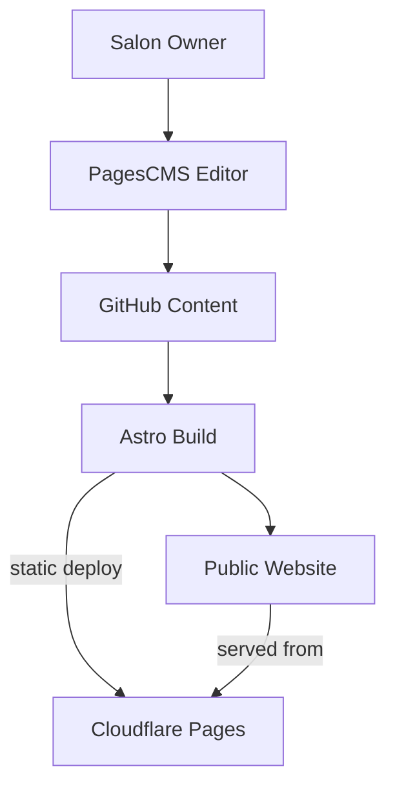

# Blueprint: savvops/vanity-hair-main

_Auto-generated architectural documentation — 2026-09-24 (Phase 1). Built from the repository file tree, README and manifests._

## Diagram

## How it works

vanity-hair-main is the website for Vanity Hair & Esthetics, a Winnipeg salon (vanityhairwpg.ca) — a client project built with Astro 7 and Tailwind CSS, deployed on Cloudflare Pages. Content is managed through PagesCMS, a git-based visual CMS: the salon owner edits text and images in a browser UI, changes commit to the repo, and the site rebuilds.

The build pipeline (`npm run check`, `build`, `test`) validates TypeScript/Astro, regenerates responsive images, and runs Playwright browser tests before deploy. Legacy material — the old Netlify/Decap admin and unused templates (including an archived quote-form experiment) — is quarantined under `archive/`, outside the build sources. `wrangler.toml` configures the Cloudflare deployment.

## Key files

- `src/` — Astro pages, components, sections, UI
- `src/content.config.ts` — content schema for PagesCMS
- `public/` — fonts, images, videos, admin
- `astro.config.mjs` / `wrangler.toml` — build and Cloudflare config
- `vanity-hair-task.md` — project task brief
- `archive/` — retired Decap admin and unused templates (not built)

## For the owner

This is a client website for a Winnipeg hair salon — pretty, fast, and editable by a non-technical owner through a visual CMS. Static hosting on Cloudflare keeps it free and instant, with automated checks guarding every update.

_Corrected 2026-09-25: removed the phantom quote-API flow (that code only exists under `archive/`, outside the build)._
